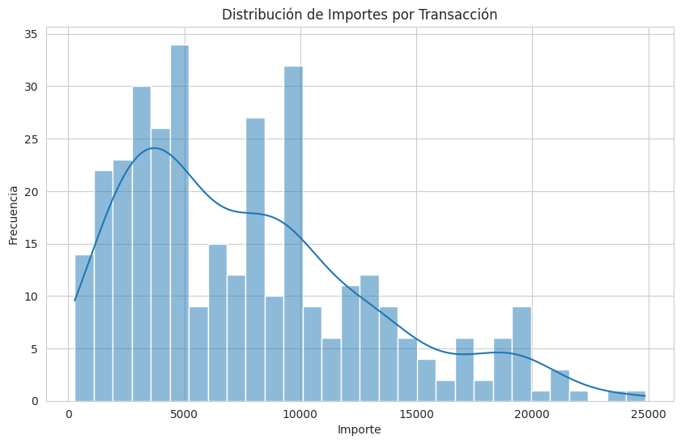
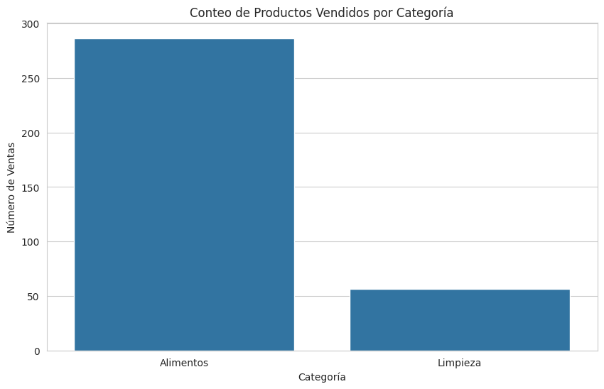
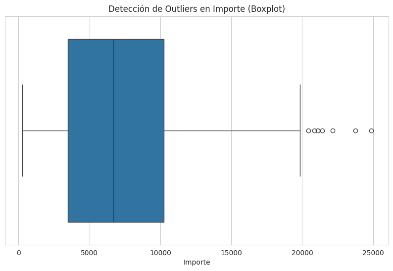
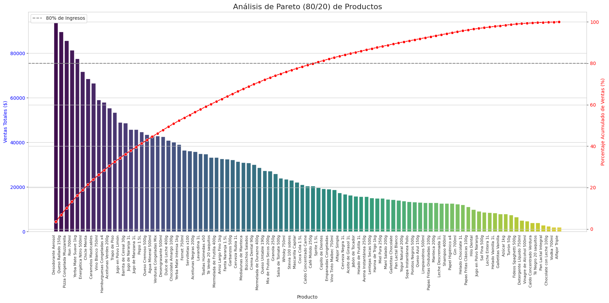
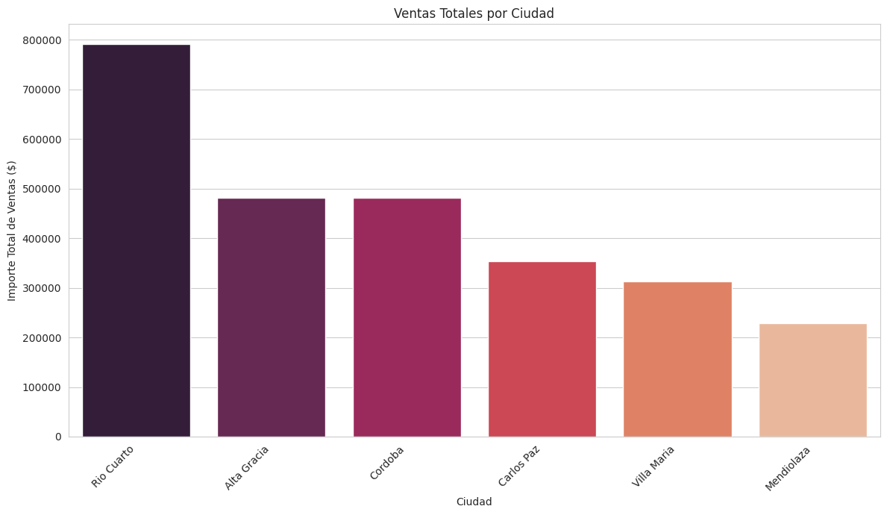

# SPRINT 1

## 1.1. Tema del Proyecto
**"Chatbot Interactivo para el Minimarket Aurelion"**  
El minimarket Aurelion opera en un mercado minorista competitivo, donde la eficiencia en la gestión de inventario y la fidelización de clientes son cruciales para la supervivencia. 
Este minimarket opera con una base de datos maestra de 100 clientes únicos y ha registrado 120 transacciones de venta entre enero y junio de 2024, acumulando un total de ingresos de $2,651,417. Si bien la tienda ha logrado una fidelización efectiva con un segmento de alto valor, el negocio enfrenta un riesgo operativo significativo debido a la extrema volatilidad de sus ingresos, evidenciado por la fuerte caída en abril que fue seguida por un pico de recuperación en mayo, lo que dificulta la planificación del flujo de caja y la gestión de inventario. Financieramente, la categoría de Limpieza es actualmente el principal motor de ingresos de la tienda superando a Alimentos, y el Desodorante Aerosol figura como el producto de mayor valor en ventas. Operacionalmente, Aurelion opera en al menos cuatro ciudades distintas y su dependencia del Efectivo como el medio de pago más utilizado (37 transacciones) añade complejidad y riesgo en la gestión de cobros en comparación con las transacciones digitales.
---
---
---

## 1.2. Problema
El problema central del minimarket Aurelion es la inaccesibilidad total a su propia información de negocio. Actualmente, todos los datos vitales de la empresa —clientes, productos y transacciones— se encuentran aislados en archivos de Excel en crudo, sin ningún tipo de procesamiento, documentación o interfaz gráfica que permita su consulta. Esto crea un "desierto de información", donde los dueños o gerentes son incapaces de responder preguntas críticas para la estrategia del negocio de manera ágil. La falta de un sistema para analizar la estructura, los tipos de datos, características, entre otros, de las bases de datos, hace que el proceso manual sea lento y fragmentado, lo que imposibilita la toma de decisiones informadas en tiempo real. En resumen, el problema es la carencia absoluta de un canal interactivo y centralizado que exponga las características de sus bases de datos de forma sencilla para los interesados.
---
---
---

## 1.3. Solución Propuesta
Para resolver la carencia de un canal de información, se propone el desarrollo de un chatbot que funcionará como un asistente de consulta interactivo y centralizado. Este chatbot está diseñado para interpretar las solicitudes del usuario a través de un menú de opciones predefinidas, atacando directamente el problema de la inaccesibilidad de la información. De esta manera, la solución convierte los datos aislados de los archivos Excel en conocimiento estructurado y accesible bajo demanda, permitiendo que cualquier interesado pueda comprender el panorama completo del proyecto de forma instantánea y sin necesidad de conocimientos técnicos.
---
---
---

## 1.4. Características set de datos

A continuación se detalla la estructura, los tipos de datos y la descripción de cada tabla.

### 1.4.1. Base de Datos: Clientes
* **Fuente:** `clientes.xlsx - clientes.csv`
* **Definición:** Tabla maestra que contiene el registro único de todos los clientes de la tienda.
* **Columnas:** El catálogo está compuesto por las siguientes columnas:
1.  **`id_cliente`**
    * **Tipo y Naturaleza:** Entero, Cuantitativo.
    * **Llave:** **Primaria (PK)**.
    * **Descripción:** Es el **identificador numérico único** asignado a cada cliente.
2.  **`nombre_cliente`**
    * **Tipo y Naturaleza:** Texto, Cualitativo.
    * **Descripción:** Contiene el nombre y apellido completo del cliente.
3.  **`email`**
    * **Tipo y Naturaleza:** Texto, Cualitativo.
    * **Descripción:** Almacena la dirección de correo electrónico del cliente.
4.  **`ciudad`**
    * **Tipo y Naturaleza:** Texto, Cualitativo.
    * **Descripción:** Indica la ciudad de residencia del cliente.
5.  **`fecha_alta`**
    * **Tipo y Naturaleza:** Fecha, Cualitativo.
    * **Descripción:** Registra la fecha en la que el cliente se registró por primera vez en el sistema.

* **Nota: Todos los campos provienen de origen **Primario** y tienen una estructura de forma **Estructurada**.**
---
---
---

### 1.4.2. Base de Datos: Productos
* **Fuente:** `productos.xlsx - productos.csv`
* **Definición:** Catálogo maestro que describe cada uno de los productos disponibles para la venta.
* **Columnas:** El catálogo está compuesto por las siguientes columnas:
1.  **`id_producto`**
    * **Tipo y Naturaleza:** Entero, Cuantitativo.
    * **Llave:** **Primaria (PK)**.
    * **Descripción:** Es el **identificador numérico único** asignado a cada producto.
2.  **`nombre_producto`**
    * **Tipo y Naturaleza:** Texto, Cualitativo.
    * **Descripción:** Contiene el nombre comercial del producto.
3.  **`categoria`**
    * **Tipo y Naturaleza:** Texto, Cualitativo.
    * **Descripción:** Define la categoría a la que pertenece el producto (ej. Alimentos, Limpieza).
4.  **`precio_unitario`**
    * **Tipo y Naturaleza:** Decimal, Cuantitativo.
    * **Descripción:** Indica el precio de venta por una unidad del producto.

* **Nota: Todos los campos provienen de origen **Primario** y tienen una estructura de forma **Estructurada**.**
---
---
---

### 1.4.3. Base de Datos: Ventas
* **Fuente:** `ventas.xlsx - ventas.csv`
* **Definición:** Tabla transaccional que funciona como encabezado de cada orden de compra.
* **Columnas:** El catálogo está compuesto por las siguientes columnas:
1.  **`id_venta`**
    * **Tipo y Naturaleza:** Entero, Cuantitativo.
    * **Llave:** **Primaria (PK)**.
    * **Descripción:** Es el **identificador numérico único** asignado a cada transacción de venta.
2.  **`fecha`**
    * **Tipo y Naturaleza:** Fecha, Cualitativo.
    * **Origen:** Primario.
    * **Descripción:** Indica la fecha exacta en la que se procesó la venta.
3.  **`id_cliente`**
    * **Tipo y Naturaleza:** Entero, Cuantitativo.
    * **Llave:** **Foránea (FK)**.
    * **Origen:** Primario.
    * **Descripción:** Identificador que **referencia al cliente** en la tabla **Clientes**.
4.  **`nombre_cliente`**
    * **Tipo y Naturaleza:** Texto, Cualitativo.
    * **Origen:** Secundario.
    * **Descripción:** Nombre del cliente, incluido como un **dato denormalizado** para facilitar la consulta rápida sin necesidad de unir tablas.
5.  **`email`**
    * **Tipo y Naturaleza:** Texto, Cualitativo.
    * **Origen:** Secundario.
    * **Descripción:** Dirección de correo electrónico del cliente, incluido como un **dato denormalizado** para facilitar la consulta rápida.
6.  **`medio_pago`**
    * **Tipo y Naturaleza:** Texto, Cualitativo.
    * **Origen:** Primario.
    * **Descripción:** Detalla el método utilizado para el pago de la compra (ej. tarjeta, QR, efectivo, etc.).

* **Nota: Todos los campos provienen de origen **Primario** y tienen una estructura de forma **Estructurada**.**
---
---
---

### 1.4.4. Base de Datos: Detalle de Ventas
* **Fuente:** `detalle_ventas.xlsx - detalle_ventas.csv`
* **Definición:** Tabla transaccional que desglosa los productos y cantidades de cada venta.
* **Columnas:** El catálogo está compuesto por las siguientes columnas:
1.  **`id_venta`**
    * **Tipo y Naturaleza:** Entero, Cuantitativo.
    * **Llave:** **Foránea (FK)**.
    * **Origen:** Primario.
    * **Descripción:** Es la clave que **referencia a la venta** en la tabla **Ventas** (encabezado de la orden).
2.  **`id_producto`**
    * **Tipo y Naturaleza:** Entero, Cuantitativo.
    * **Llave:** **Foránea (FK)**.
    * **Origen:** Primario.
    * **Descripción:** Es la clave que **referencia al producto** en la tabla **Productos** (catálogo).
3.  **`nombre_producto`**
    * **Tipo y Naturaleza:** Texto, Cualitativo.
    * **Origen:** Secundario.
    * **Descripción:** Nombre del producto, incluido como un **dato denormalizado** para facilitar la consulta.
4.  **`cantidad`**
    * **Tipo y Naturaleza:** Entero, Cuantitativo.
    * **Origen:** Primario.
    * **Descripción:** Representa el número de unidades vendidas de ese producto específico dentro de la venta.
5.  **`precio_unitario`**
    * **Tipo y Naturaleza:** Decimal, Cuantitativo.
    * **Origen:** Secundario.
    * **Descripción:** Precio del producto registrado **al momento de la venta** (dato denormalizado, capturado para mantener el histórico del precio).
6.  **`importe`**
    * **Tipo y Naturaleza:** Decimal, Cuantitativo.
    * **Origen:** Secundario.
    * **Descripción:** Monto total calculado para esta línea de producto (resultado de multiplicar **`cantidad`** por **`precio_unitario`**).

* **Nota: Todos los campos provienen de origen **Primario** y tienen una estructura de forma **Estructurada**.**
---
---
---

## 1.5. Pasos
### Paso 1: Configuración y Variables Globales ⚙️
En este primer paso, se prepara todo lo necesario para que el programa funcione. Se definen **parámetros fijos** como el puerto `8000` donde operará el servidor y la ubicación del archivo `Documentación.md`. Además, se crean "contenedores" o **diccionarios vacíos** que más adelante guardarán la información leída del documento. Finalmente, se establecen "mapas" que traducen las opciones del usuario (como "1" o "4.1") a los títulos reales de las secciones en el documento.


### Paso 2: Función para Cargar y Procesar el Documento 📄➡️🧠
Este es el cerebro del programa. Aquí se define una función que **lee el archivo `Documentación.md` y lo procesa**. La función abre el archivo, lo divide inteligentemente en secciones principales (usando `##`) y subsecciones (usando `###`), y limpia cada trozo de texto. Toda esta información ya organizada se guarda en los diccionarios que se crearon en el paso anterior, dejando los datos listos para ser consultados.


### Paso 3: Ejecución Principal y Lógica del Servidor 🌐💬
En el último paso, el programa se pone en marcha. Primero, llama a la función del paso 2 para cargar toda la documentación en memoria. Luego, **inicia un servidor web** que se queda a la espera de que un usuario se conecte. El servidor sabe cómo manejar dos tipos de peticiones:
* Si es una petición **GET** (cuando el usuario entra a la página por primera vez), le sirve la interfaz gráfica (el archivo `index.html`).
* Si es una petición **POST** (cuando el usuario hace clic en una opción del chatbot), el servidor analiza la opción elegida, busca la respuesta correspondiente en los datos ya cargados y se la devuelve al navegador para que la muestre.
---
---
---

## 1.6. Diagrama de flujo
Para ver el Diagrama de Flujo da click en el siguiente enlace:  
<a href="https://drive.google.com/file/d/14wclspP4Igc2m6Fjd_yUgE8aAijw5vF-/view?usp=sharing" target="_blank">Diagrama de Flujo</a>
---
---
---

## 1.7. Pseudocódigo
### Paso 1: Configuración y Variables Globales
```plaintext
// Definir constantes y variables que se usarán en todo el programa.
CONSTANTE PUERTO = 8000
CONSTANTE RUTA_DOCUMENTO = "ruta/a/Documentación.md"

// Declarar variables para almacenar el contenido procesado del documento.
VARIABLE GLOBAL documentacion = DICCIONARIO VACÍO
VARIABLE GLOBAL subsecciones_documentacion = DICCIONARIO VACÍO

// Mapear las opciones del menú a los títulos exactos de las secciones en el documento.
CONSTANTE mapeo_menu = {
    "1": "1. Tema del Proyecto",
    "2": "2. Problema",
    "3": "3. Solución Propuesta",
    "4": "4. Características set de datos",
    "5": "5. Pasos",
    "6": "6. Diagrama de flujo",
    "7": "7. Pseudocódigo"
}

// Mapear las opciones del submenú a los títulos de las subsecciones.
CONSTANTE mapeo_subsecciones = {
    "4.1": "4.1. Base de Datos: Clientes",
    "4.2": "4.2. Base de Datos: Productos",
    "4.3": "4.3. Base de Datos: Ventas",
    "4.4": "4.4. Base de Datos: Detalle de Ventas"
}
```

### Paso 2: Función para Cargar y Procesar el Documento
```plaintext
FUNCIÓN cargar_documentacion():
    // Esta función lee el archivo .md y lo divide en secciones y subsecciones.
    
    // Inicializar diccionarios para guardar el contenido.
    VARIABLE contenido_local = DICCIONARIO VACÍO
    VARIABLE subsecciones_locales = DICCIONARIO VACÍO

    // Intentar leer el archivo para manejar posibles errores.
    INTENTAR:
        // Abrir y leer todo el texto del archivo.
        VARIABLE texto_completo = LEER_ARCHIVO(RUTA_DOCUMENTO)
        
        // Dividir el texto en partes usando los títulos de sección (##) como separadores.
        VARIABLE secciones = DIVIDIR_TEXTO(texto_completo, usando el patrón de título "## \d. ...")

        // Recorrer la lista de secciones para procesar cada título y su contenido.
        PARA cada i DESDE 1 HASTA LONGITUD(secciones) CON PASO 2:
            VARIABLE titulo = secciones[i]
            VARIABLE cuerpo = secciones[i+1]

            // Caso especial para la sección "4. Características set de datos".
            SI titulo ES IGUAL A "4. Características set de datos":
                VARIABLE partes_subseccion = DIVIDIR_TEXTO(cuerpo, usando el patrón de subtítulo "### 4.\d. ...")
                contenido_local[titulo] = partes_subseccion[0]

                // Recorrer las subsecciones para guardarlas.
                PARA cada j DESDE 1 HASTA LONGITUD(partes_subseccion) CON PASO 2:
                    VARIABLE sub_titulo = partes_subseccion[j]
                    VARIABLE sub_cuerpo = partes_subseccion[j+1]
                    subsecciones_locales[sub_titulo] = OBTENER_TEXTO_ANTES_DE(sub_cuerpo, "- - -")
                FIN PARA
            SINO:
                // Para todas las demás secciones.
                contenido_local[titulo] = OBTENER_TEXTO_ANTES_DE(cuerpo, "- - -")
            FIN SI
        FIN PARA
        
    CAPTURAR FileNotFoundError:
        ESCRIBIR_EN_CONSOLA("Error: No se encontró el archivo de documentación.")
    CAPTURAR OtroError:
        ESCRIBIR_EN_CONSOLA("Error al leer el archivo.")
    
    // Devolver los diccionarios con la información.
    RETORNAR contenido_local, subsecciones_locales
FIN FUNCIÓN
```

### Paso 3: Ejecución Principal y Lógica del Servidor
```plaintext
// Llamar a la función al iniciar el programa.
documentacion, subsecciones_documentacion = cargar_documentacion()

// Iniciar el servidor web.
INICIAR SERVIDOR en PUERTO con el manejador de peticiones:
    
    ESCRIBIR_EN_CONSOLA("¡Hola! Soy Aurelion, tu asistente virtual.")
    ESCRIBIR_EN_CONSOLA("Servidor iniciado en http://localhost:" + PUERTO)

    // El servidor se queda esperando peticiones.
    MIENTRAS SERVIDOR_ESTE_ACTIVO:
        ESPERAR_PETICION()

                // *** MANEJADOR DE PETICIONES ***
        
        // CUANDO LLEGA UNA PETICIÓN GET:
        PROCEDIMIENTO manejar_peticion_GET(peticion):
            SI peticion.ruta ES IGUAL A "/":
                peticion.ruta = "/templates/index.html"
            FIN SI
            SERVIR_ARCHIVO(peticion.ruta)
        FIN PROCEDIMIENTO

        // CUANDO LLEGA UNA PETICIÓN POST a /api/chatbot:
        PROCEDIMIENTO manejar_peticion_POST(peticion):
            SI peticion.ruta ES IGUAL A "/api/chatbot":
                INTENTAR:
                    VARIABLE datos_recibidos = LEER_CUERPO_JSON(peticion)
                    VARIABLE opcion_usuario = datos_recibidos["opcion"]
                    VARIABLE subopcion_usuario = datos_recibidos["subopcion"]
                    VARIABLE datos_respuesta = DICCIONARIO VACÍO

                    // Lógica para decidir qué responder.
                    SI subopcion_usuario EXISTE:
                        VARIABLE titulo_sub = mapeo_subsecciones[subopcion_usuario]
                        datos_respuesta["respuesta"] = subsecciones_documentacion[titulo_sub]
                    
                    SINO SI opcion_usuario ES IGUAL A "4":
                        VARIABLE titulo_seccion = mapeo_menu["4"]
                        datos_respuesta["respuesta"] = documentacion[titulo_seccion]
                        datos_respuesta["subsecciones"] = VERDADERO
                        datos_respuesta["opciones_subseccion"] = [
                            { "texto": "Base de Datos: Clientes", "valor": "4.1" },
                            // ... y las otras subopciones ...
                        ]

                    SINO SI opcion_usuario EXISTE:
                        VARIABLE titulo_seccion = mapeo_menu[opcion_usuario]
                        datos_respuesta["respuesta"] = documentacion[titulo_seccion]
                    
                    SINO:
                        ENVIAR_RESPUESTA_ERROR(400, "Opción no válida.")
                        RETORNAR
                    FIN SI

                    ENVIAR_RESPUESTA_OK(200, datos_respuesta)

                CAPTURAR ErrorDeServidor:
                    ENVIAR_RESPUESTA_ERROR(500, "Error interno del servidor.")
                FIN INTENTAR
            FIN SI
        FIN PROCEDIMIENTO
    FIN MIENTRAS
```
---
---
---

# SPRINT 2

## 2.1. Problema
Actualmente, el Minimarket Aurelion opera "a ciegas". Aunque registran transacciones, no están utilizando esa información para tomar decisiones. Sin embargo, surge un problema crítico de calidad de datos que impediría cualquier análisis serio si no se corrige primero.
Los puntos de dolor específicos son:
Inconsistencia Grave en Categorización (Data Quality), esto impacta en que si por ejemplo el dueño quiere saber "¿Cuánto vendemos en bebidas alcohólicas vs. limpieza?", el reporte actual diría que la gente se está "bebiendo" los productos de limpieza. Esto lleva a decisiones de inventario erróneas; además, tienen un desconocimiento sobre qué productos les están generando mayores ingresos.
Otro punto de dolor es el "Desconocimiento del Cliente", el minimarket tiene datos de clientes (Ciudad, Email), pero no saben cuales son las ciudades más rentables.
Y finalmente presentan "Falta de visión temporal", no saben qué días de la semana se vende más para planificar turnos de personal o stock.
---
---
---

## 2.2. Solución Propuesta
Para solucionar la ceguera operativa del negocio, se propone implementar el "Sistema de Inteligencia de Ventas Aurelion" ejecutando primero una fase crítica de transformación de datos (ETL) donde se apliquen reglas de limpieza para corregir masivamente la clasificación errónea de los productos y se unifiquen las tablas dispersas en una fuente de información maestra y confiable. Una vez asegurada la calidad de los datos, se procederá a la construcción de un dashboard analítico que permita a la gerencia identificar visualmente los productos más rentables mediante un análisis de Pareto, geolocalizar las zonas de mayor demanda para optimizar la logística y descubrir patrones de venta temporales que ayuden a planificar mejor el inventario y los recursos, transformando así registros inconsistentes en decisiones estratégicas claras.
---
---
---

## 2.3 Limpieza de Datos
```python
# Importamos las librerías necesarias para el proyecto
import pandas as pd
import numpy as np
import os
```

Define la ruta a la carpeta que contiene los archivos de Excel.  
data_path = 'BDs'
```python
data_path = 'BDs'
clientes_path = os.path.join(data_path, 'clientes.xlsx')
productos_path = os.path.join(data_path, 'productos.xlsx')
ventas_path = os.path.join(data_path, 'ventas.xlsx')
detalle_ventas_path = os.path.join(data_path, 'detalle_ventas.xlsx')
```

Cargar cada archivo de Excel en un DataFrame de pandas.
```python
print("Cargando archivos...")
df_clientes = pd.read_excel(clientes_path)
df_productos = pd.read_excel(productos_path)
df_ventas = pd.read_excel(ventas_path)
df_detalle_ventas = pd.read_excel(detalle_ventas_path)
print("Archivos cargados correctamente.")
```

```text
Cargando archivos...
Archivos cargados correctamente.
```

Pre-análisis para identificar información de las bases de datos, inclúyase columnas, primeras y últimas filas.
```python
# Información general como cuadro resumen
print("\nCuadro resumen de clientes.xlsx:")
df_clientes.info(verbose=False)
print("\nCuadro resumen de detalle_ventas.xlsx:")
df_productos.info(verbose=False)
print("\nCuadro resumen de productos.xlsx:")
df_ventas.info(verbose=False)
print("\nCuadro resumen de ventas.xlsx:")
df_detalle_ventas.info(verbose=False)

# Columnas de cada DataFrame
print("\Columnas de clientes.xlsx:", df_clientes.columns)
print("\Columnas de detalle_ventas.xlsx:", df_productos.columns)
print("\Columnas de productos.xlsx:", df_ventas.columns)
print("\Columnas de ventas.xlsx:", df_detalle_ventas.columns)

# Mostrar las primeras filas de cada archivo
print("\nPrimeras filas de clientes.xlsx:")
print(df_clientes.head())
print("\nPrimeras filas de productos.xlsx:")
print(df_productos.head())
print("\nPrimeras filas de ventas.xlsx:")
print(df_ventas.head())
print("\nPrimeras filas de detalLe_ventas.xlsx:")
print(df_detalle_ventas.head())

# Mostrar las últimas filas de cada archivo
print("\nUltimas filas de clientes.xlsx:")
print(df_clientes.tail())
print("\nUltimas filas de productos.xlsx:")
print(df_productos.tail())
print("\nUltimas filas de ventas.xlsx:")
print(df_ventas.tail())
print("\nUltimas filas de detalLe_ventas.xlsx:")
print(df_detalle_ventas.tail())
```

```text

Cuadro resumen de clientes.xlsx:
<class 'pandas.core.frame.DataFrame'>
RangeIndex: 100 entries, 0 to 99
Columns: 5 entries, id_cliente to fecha_alta
dtypes: datetime64[ns](1), int64(1), object(3)
memory usage: 4.0+ KB

Cuadro resumen de detalle_ventas.xlsx:
<class 'pandas.core.frame.DataFrame'>
RangeIndex: 100 entries, 0 to 99
Columns: 4 entries, id_producto to precio_unitario
dtypes: int64(2), object(2)
memory usage: 3.3+ KB

Cuadro resumen de productos.xlsx:
<class 'pandas.core.frame.DataFrame'>
RangeIndex: 120 entries, 0 to 119
Columns: 6 entries, id_venta to medio_pago
dtypes: datetime64[ns](1), int64(2), object(3)
memory usage: 5.8+ KB

Cuadro resumen de ventas.xlsx:
<class 'pandas.core.frame.DataFrame'>
RangeIndex: 343 entries, 0 to 342
Columns: 6 entries, id_venta to importe
dtypes: int64(5), object(1)
memory usage: 16.2+ KB
\Columnas de clientes.xlsx: Index(['id_cliente', 'nombre_cliente', 'email', 'ciudad', 'fecha_alta'], dtype='object')
\Columnas de detalle_ventas.xlsx: Index(['id_producto', 'nombre_producto', 'categoria', 'precio_unitario'], dtype='object')
\Columnas de productos.xlsx: Index(['id_venta', 'fecha', 'id_cliente', 'nombre_cliente', 'email',
       'medio_pago'],
      dtype='object')
\Columnas de ventas.xlsx: Index(['id_venta', 'id_producto', 'nombre_producto', 'cantidad',
       'precio_unitario', 'importe'],
      dtype='object')

Primeras filas de clientes.xlsx:
   id_cliente   nombre_cliente                     email      ciudad  \
0           1    Mariana Lopez    mariana.lopez@mail.com  Carlos Paz   
1           2    Nicolas Rojas    nicolas.rojas@mail.com  Carlos Paz   
2           3  Hernan Martinez  hernan.martinez@mail.com  Rio Cuarto   
3           4     Uma Martinez     uma.martinez@mail.com  Carlos Paz   
4           5  Agustina Flores  agustina.flores@mail.com     Cordoba   

  fecha_alta  
0 2023-01-01  
1 2023-01-02  
2 2023-01-03  
3 2023-01-04  
4 2023-01-05  

Primeras filas de productos.xlsx:
   id_producto     nombre_producto  categoria  precio_unitario
0            1      Coca Cola 1.5L  Alimentos             2347
1            2          Pepsi 1.5L   Limpieza             4973
2            3         Sprite 1.5L  Alimentos             4964
3            4  Fanta Naranja 1.5L   Limpieza             2033
4            5  Agua Mineral 500ml  Alimentos             4777

Primeras filas de ventas.xlsx:
   id_venta      fecha  id_cliente    nombre_cliente  \
0         1 2024-06-19          62  Guadalupe Romero   
1         2 2024-03-17          49      Olivia Gomez   
2         3 2024-01-13          20      Tomas Acosta   
3         4 2024-02-27          36    Martina Molina   
4         5 2024-06-11          56        Bruno Diaz   

                       email     medio_pago  
0  guadalupe.romero@mail.com        tarjeta  
1      olivia.gomez@mail.com             qr  
2      tomas.acosta@mail.com        tarjeta  
3    martina.molina@mail.com  transferencia  
4        bruno.diaz@mail.com        tarjeta  

Primeras filas de detalLe_ventas.xlsx:
   id_venta  id_producto        nombre_producto  cantidad  precio_unitario  \
0         1           90    Toallas Húmedas x50         1             2902   
1         2           82  Aceitunas Negras 200g         5             2394   
2         2           39     Helado Vainilla 1L         5              469   
3         2           70           Fernet 750ml         2             4061   
4         2           22  Medialunas de Manteca         1             2069   

   importe  
0     2902  
1    11970  
2     2345  
3     8122  
4     2069  

Ultimas filas de clientes.xlsx:
    id_cliente  nombre_cliente                    email       ciudad  \
95          96  Rocio Gonzalez  rocio.gonzalez@mail.com      Cordoba   
96          97     Uma Alvarez     uma.alvarez@mail.com      Cordoba   
97          98   Camila Castro   camila.castro@mail.com      Cordoba   
98          99    Bruno Molina    bruno.molina@mail.com  Villa Maria   
99         100  Agustina Lopez  agustina.lopez@mail.com      Cordoba   

   fecha_alta  
95 2023-04-06  
96 2023-04-07  
97 2023-04-08  
98 2023-04-09  
99 2023-04-10  

Ultimas filas de productos.xlsx:
    id_producto      nombre_producto  categoria  precio_unitario
95           96        Suavizante 1L   Limpieza             4920
96           97  Limpiavidrios 500ml  Alimentos              872
97           98  Desengrasante 500ml   Limpieza             2843
98           99          Esponjas x3  Alimentos             2430
99          100        Trapo de Piso   Limpieza             4854

Ultimas filas de ventas.xlsx:
     id_venta      fecha  id_cliente    nombre_cliente  \
115       116 2024-03-18          25     Karina Castro   
116       117 2024-03-14          72  Camila Rodriguez   
117       118 2024-02-09          84     Pablo Sanchez   
118       119 2024-02-07          51    Agustina Gomez   
119       120 2024-04-21          72  Camila Rodriguez   

                         email medio_pago  
115     karina.castro@mail.com         qr  
116  camila.rodriguez@mail.com    tarjeta  
117     pablo.sanchez@mail.com   efectivo  
118    agustina.gomez@mail.com         qr  
119  camila.rodriguez@mail.com    tarjeta  

Ultimas filas de detalLe_ventas.xlsx:
     id_venta  id_producto        nombre_producto  cantidad  precio_unitario  \
338       118           70           Fernet 750ml         2             4061   
339       118           93     Cepillo de Dientes         3             2142   
340       118           50             Azúcar 1kg         2              727   
341       119           45  Fideos Spaghetti 500g         5              745   
342       120           20      Pan Lactal Blanco         5             1571   

     importe  
338     8122  
339     6426  
340     1454  
341     3725  
342     7855  
```

```text
<>:12: SyntaxWarning: invalid escape sequence '\C'
<>:13: SyntaxWarning: invalid escape sequence '\C'
<>:14: SyntaxWarning: invalid escape sequence '\C'
<>:15: SyntaxWarning: invalid escape sequence '\C'
<>:12: SyntaxWarning: invalid escape sequence '\C'
<>:13: SyntaxWarning: invalid escape sequence '\C'
<>:14: SyntaxWarning: invalid escape sequence '\C'
<>:15: SyntaxWarning: invalid escape sequence '\C'
/tmp/ipython-input-2938354417.py:12: SyntaxWarning: invalid escape sequence '\C'
  print("\Columnas de clientes.xlsx:", df_clientes.columns)
/tmp/ipython-input-2938354417.py:13: SyntaxWarning: invalid escape sequence '\C'
  print("\Columnas de detalle_ventas.xlsx:", df_productos.columns)
/tmp/ipython-input-2938354417.py:14: SyntaxWarning: invalid escape sequence '\C'
  print("\Columnas de productos.xlsx:", df_ventas.columns)
/tmp/ipython-input-2938354417.py:15: SyntaxWarning: invalid escape sequence '\C'
  print("\Columnas de ventas.xlsx:", df_detalle_ventas.columns)
```

Limpieza de df_clientes
```python
df_clientes['nombre_cliente'].fillna('Desconocido', inplace=True)
df_clientes['id_cliente'] = df_clientes['id_cliente'].astype(int)
```

```text
/tmp/ipython-input-3370447280.py:1: FutureWarning: A value is trying to be set on a copy of a DataFrame or Series through chained assignment using an inplace method.
The behavior will change in pandas 3.0. This inplace method will never work because the intermediate object on which we are setting values always behaves as a copy.

For example, when doing 'df[col].method(value, inplace=True)', try using 'df.method({col: value}, inplace=True)' or df[col] = df[col].method(value) instead, to perform the operation inplace on the original object.


  df_clientes['nombre_cliente'].fillna('Desconocido', inplace=True)
```

Limpieza de df_productos
```python
df_productos['nombre_producto'].fillna('Sin Nombre', inplace=True)
df_productos['precio_unitario'] = pd.to_numeric(df_productos['precio_unitario'], errors='coerce')
df_productos['precio_unitario'].fillna(0, inplace=True)
df_productos['id_producto'] = df_productos['id_producto'].astype(int)
```

```text
/tmp/ipython-input-2802512181.py:1: FutureWarning: A value is trying to be set on a copy of a DataFrame or Series through chained assignment using an inplace method.
The behavior will change in pandas 3.0. This inplace method will never work because the intermediate object on which we are setting values always behaves as a copy.

For example, when doing 'df[col].method(value, inplace=True)', try using 'df.method({col: value}, inplace=True)' or df[col] = df[col].method(value) instead, to perform the operation inplace on the original object.


  df_productos['nombre_producto'].fillna('Sin Nombre', inplace=True)
/tmp/ipython-input-2802512181.py:3: FutureWarning: A value is trying to be set on a copy of a DataFrame or Series through chained assignment using an inplace method.
The behavior will change in pandas 3.0. This inplace method will never work because the intermediate object on which we are setting values always behaves as a copy.

For example, when doing 'df[col].method(value, inplace=True)', try using 'df.method({col: value}, inplace=True)' or df[col] = df[col].method(value) instead, to perform the operation inplace on the original object.


  df_productos['precio_unitario'].fillna(0, inplace=True)
```

Corrigiendo las categorías de productos
```python
productos_limpieza = [
    'Detergente Líquido 750ml',
    'Lavandina 1L',
    'Jabón de Tocador',
    'Shampoo 400ml',
    'Papel Higiénico x4',
    'Servilletas x100',
    'Toallas Húmedas x50',
    'Desodorante Aerosol',
    'Crema Dental 90g',
    'Cepillo de Dientes',
    'Hilo Dental',
    'Mascarilla Capilar',
    'Suavizante 1L',
    'Limpiavidrios 500ml',
    'Desengrasante 500ml',
    'Esponjas x3',
    'Trapo de Piso'
]

# Asignar 'Limpieza' a los productos en la lista, el resto son Alimentos
df_productos['categoria'] = df_productos['nombre_producto'].apply(lambda x: 'Limpieza' if x in productos_limpieza else 'Alimentos')

print("Categorías de productos corregidas basándose en la lista.")
display(df_productos.head())
```

```text
Categorías de productos corregidas basándose en la lista.
```

```text
   id_producto     nombre_producto  categoria  precio_unitario
0            1      Coca Cola 1.5L  Alimentos             2347
1            2          Pepsi 1.5L  Alimentos             4973
2            3         Sprite 1.5L  Alimentos             4964
3            4  Fanta Naranja 1.5L  Alimentos             2033
4            5  Agua Mineral 500ml  Alimentos             4777
```

Limpieza de df_ventas
```python
df_ventas['fecha'] = pd.to_datetime(df_ventas['fecha'])
df_ventas['id_venta'] = df_ventas['id_venta'].astype(int)
df_ventas['id_cliente'] = df_ventas['id_cliente'].astype(int)
```

Limpieza de df_detalle_ventas
```python
df_detalle_ventas['id_venta'] = df_detalle_ventas['id_venta'].astype(int)
df_detalle_ventas['id_producto'] = df_detalle_ventas['id_producto'].astype(int)
df_detalle_ventas['cantidad'] = df_detalle_ventas['cantidad'].astype(int)
```

Antes de unificar, eliminamos columnas duplicadas que ya existen en otras tablas para evitar conflictos en la unificación.
```python
df_ventas.drop(columns=['nombre_cliente', 'email'], inplace=True)
df_detalle_ventas.drop(columns=['nombre_producto', 'precio_unitario'], inplace=True)

print("Limpieza de datos completada.")
```

```text
Limpieza de datos completada.
```

Unimos ventas con los detalles de la venta
```python
df_ventas_detalle = pd.merge(df_ventas, df_detalle_ventas, on='id_venta')
```

Añadimos la información de los productos
```python
df_ventas_productos = pd.merge(df_ventas_detalle, df_productos, on='id_producto')
```

Finalmente, integramos la información de los clientes
```python
df_analitico_principal = pd.merge(df_ventas_productos, df_clientes, on='id_cliente')

print("¡Unificación completada!")
```

```text
¡Unificación completada!
```

```python
print("\nMostrando las primeras 10 filas del DataFrame analítico principal:")
print(df_analitico_principal.head(10))

print("\nInformación general del DataFrame final:")
df_analitico_principal.info()
```

```text

Mostrando las primeras 10 filas del DataFrame analítico principal:
   id_venta      fecha  id_cliente     medio_pago  id_producto  cantidad  \
0         1 2024-06-19          62        tarjeta           90         1   
1         2 2024-03-17          49             qr           82         5   
2         2 2024-03-17          49             qr           39         5   
3         2 2024-03-17          49             qr           70         2   
4         2 2024-03-17          49             qr           22         1   
5         2 2024-03-17          49             qr           79         4   
6         3 2024-01-13          20        tarjeta            9         2   
7         3 2024-01-13          20        tarjeta            2         2   
8         3 2024-01-13          20        tarjeta           85         1   
9         4 2024-02-27          36  transferencia            4         2   

   importe             nombre_producto  categoria  precio_unitario  \
0     2902         Toallas Húmedas x50   Limpieza             2902   
1    11970       Aceitunas Negras 200g  Alimentos             2394   
2     2345          Helado Vainilla 1L  Alimentos              469   
3     8122                Fernet 750ml  Alimentos             4061   
4     2069       Medialunas de Manteca  Alimentos             2069   
5     9680  Hamburguesas Congeladas x4  Alimentos             2420   
6     7756        Yerba Mate Suave 1kg  Alimentos             3878   
7     9946                  Pepsi 1.5L  Alimentos             4973   
8     1856       Jugo en Polvo Naranja  Alimentos             1856   
9     4066          Fanta Naranja 1.5L  Alimentos             2033   

     nombre_cliente                      email      ciudad fecha_alta  
0  Guadalupe Romero  guadalupe.romero@mail.com  Carlos Paz 2023-03-03  
1      Olivia Gomez      olivia.gomez@mail.com  Rio Cuarto 2023-02-18  
2      Olivia Gomez      olivia.gomez@mail.com  Rio Cuarto 2023-02-18  
3      Olivia Gomez      olivia.gomez@mail.com  Rio Cuarto 2023-02-18  
4      Olivia Gomez      olivia.gomez@mail.com  Rio Cuarto 2023-02-18  
5      Olivia Gomez      olivia.gomez@mail.com  Rio Cuarto 2023-02-18  
6      Tomas Acosta      tomas.acosta@mail.com  Rio Cuarto 2023-01-20  
7      Tomas Acosta      tomas.acosta@mail.com  Rio Cuarto 2023-01-20  
8      Tomas Acosta      tomas.acosta@mail.com  Rio Cuarto 2023-01-20  
9    Martina Molina    martina.molina@mail.com  Mendiolaza 2023-02-05  

Información general del DataFrame final:
<class 'pandas.core.frame.DataFrame'>
RangeIndex: 343 entries, 0 to 342
Data columns (total 14 columns):
 #   Column           Non-Null Count  Dtype         
---  ------           --------------  -----         
 0   id_venta         343 non-null    int64         
 1   fecha            343 non-null    datetime64[ns]
 2   id_cliente       343 non-null    int64         
 3   medio_pago       343 non-null    object        
 4   id_producto      343 non-null    int64         
 5   cantidad         343 non-null    int64         
 6   importe          343 non-null    int64         
 7   nombre_producto  343 non-null    object        
 8   categoria        343 non-null    object        
 9   precio_unitario  343 non-null    int64         
 10  nombre_cliente   343 non-null    object        
 11  email            343 non-null    object        
 12  ciudad           343 non-null    object        
 13  fecha_alta       343 non-null    datetime64[ns]
dtypes: datetime64[ns](2), int64(6), object(6)
memory usage: 37.6+ KB
```

Guardar el DataFrame unificado en un nuevo archivo CSV.
```python
output_path = os.path.join('BDSalida', 'reporte_analitico.csv')
df_analitico_principal.to_csv(output_path, index=False)
print(f"\nDataFrame analítico guardado como '{output_path}'")
```

```text

DataFrame analítico guardado como 'BDSalida/reporte_analitico.csv'
```
---
---
---
## 2.4. Estadísticas descriptivas básicas calculadas
Cargamos el dataset analítico que generamos en el paso anterior.
```python
df_analisis = pd.read_csv(output_path)
```

Calculando estadísticas descriptivas para el importe:
*   Media: Gasto promedio por cada línea de producto vendida.
*   Mediana: Valor central de gasto. Es muy útil si tienes ventas muy grandes (atípicas) que inflan la media; la mediana te dará un mejor sentido del gasto "típico".
*   Desviación Estándar: Qué tan dispersos son los montos de las ventas. (Un valor alto significa que los importes varían mucho, un valor bajo significa que la gente tiende a gastar cantidades similares).
```python
# Calcular estadísticas descriptivas para el importe
mean_importe = df_analisis['importe'].mean()
median_importe = df_analisis['importe'].median()
std_importe = df_analisis['importe'].std()

print(f"Media del importe: {mean_importe:.2f}")
print(f"Mediana del importe: {median_importe:.2f}")
print(f"Desviación estándar del importe: {std_importe:.2f}")
```

```text
Media del importe: 7730.08
Mediana del importe: 6702.00
Desviación estándar del importe: 5265.54
```

Calculando estadísticas descriptivas para la cantidad:
*   Media: La cantidad promedio de artículos comprados por línea de venta.
*   Mediana: La cantidad central de artículos. (Ej. "La mitad de las veces, la gente compra 3 artículos o menos").
*   Desviación Estándar: Mide la variabilidad en la cantidad de artículos comprados.
```python
# Calcular estadísticas descriptivas para la cantidad
mean_cantidad = df_analisis['cantidad'].mean()
median_cantidad = df_analisis['cantidad'].median()
std_cantidad = df_analisis['cantidad'].std()

print(f"Media de la cantidad: {mean_cantidad:.2f}")
print(f"Mediana de la cantidad: {median_cantidad:.2f}")
print(f"Desviación estándar de la cantidad: {std_cantidad:.2f}")
```

```text
Media de la cantidad: 2.96
Mediana de la cantidad: 3.00
Desviación estándar de la cantidad: 1.37
```

Calculando estadísticas descriptivas para el precio unitario:
*   Media: El precio promedio de los productos en tu catálogo (o al menos, de los que se han vendido).
*   Mediana: El precio central de los productos.
*   Desviación Estándar: Qué tanto varían los precios entre los diferentes productos.
```python
# Calcular estadísticas descriptivas para el precio unitario
mean_precio_unitario = df_analisis['precio_unitario'].mean()
median_precio_unitario = df_analisis['precio_unitario'].median()
std_precio_unitario = df_analisis['precio_unitario'].std()

print(f"Media del precio unitario: {mean_precio_unitario:.2f}")
print(f"Mediana del precio unitario: {median_precio_unitario:.2f}")
print(f"Desviación estándar del precio unitario: {std_precio_unitario:.2f}")
```

```text
Media del precio unitario: 2654.50
Mediana del precio unitario: 2512.00
Desviación estándar del precio unitario: 1308.69
```

Cálculo de la moda (el valor más frecuente) para:

*   categoria: Indica cuál es la categoría de productos más vendida ("Alimentos", "Limpieza").
*   medio_pago: Muestra el método de pago más utilizado (ej. "tarjeta" o "qr").
*   ciudad: Identifica la ciudad desde donde se realizan más compras.
*   nombre_producto: Dice cuál es el producto estrella (el nombre del producto más vendido).
```python
# Calcular la moda para múltiples columnas categóricas
moda_categoria = df_analisis['categoria'].mode()
moda_medio_pago = df_analisis['medio_pago'].mode()
moda_ciudad = df_analisis['ciudad'].mode()
moda_nombre_producto = df_analisis['nombre_producto'].mode()

print(f"Moda de la categoría: {moda_categoria.to_list()}")
print(f"Moda del medio de pago: {moda_medio_pago.to_list()}")
print(f"Moda de la ciudad: {moda_ciudad.to_list()}")
print(f"Moda del nombre del producto: {moda_nombre_producto.to_list()}")
```

```text
Moda de la categoría: ['Alimentos']
Moda del medio de pago: ['efectivo']
Moda de la ciudad: ['Rio Cuarto']
Moda del nombre del producto: ['Queso Rallado 150g']
```
---
---
---
## 2.5. Identificación de Tipo de Distribución de variables
```python
import matplotlib.pyplot as plt
import seaborn as sns

print("\n--- Generando Gráficos (Distribución y Conteo) ---")
sns.set_style("whitegrid")

# Gráfico 1: Histograma de 'importe'
plt.figure(figsize=(10, 6))
sns.histplot(df_analisis['importe'], kde=True, bins=30)
plt.title('Distribución de Importes por Transacción')
plt.xlabel('Importe')
plt.ylabel('Frecuencia')
plt.show()

# Gráfico 2: Conteo de 'categoria'
plt.figure(figsize=(10, 6))
sns.countplot(data=df_analisis, x='categoria', order=df_analisis['categoria'].value_counts().index)
plt.title('Conteo de Productos Vendidos por Categoría')
plt.xlabel('Categoría')
plt.ylabel('Número de Ventas')
plt.show()
```

```text

--- Generando Gráficos (Distribución y Conteo) ---
```




---
---
---
## 2.6. Detección de Outliers (Cuartiles y Rangos)
```python
print("\n--- Detección de Outliers (IQR) ---")

# Vamos a analizar 'importe'
Q1_importe = df_analisis['importe'].quantile(0.25)
Q3_importe = df_analisis['importe'].quantile(0.75)
IQR_importe = Q3_importe - Q1_importe
limite_inferior = Q1_importe - 1.5 * IQR_importe
limite_superior = Q3_importe + 1.5 * IQR_importe

print(f"\nAnálisis de Outliers para 'importe':")
print(f"  Q1: {Q1_importe:.2f}")
print(f"  Q3: {Q3_importe:.2f}")
print(f"  IQR: {IQR_importe:.2f}")
print(f"  Límite Inferior (Atípico): {limite_inferior:.2f}")
print(f"  Límite Superior (Atípico): {limite_superior:.2f}")

# Filtrar outliers
outliers_importe = df_analisis[(df_analisis['importe'] < limite_inferior) | (df_analisis['importe'] > limite_superior)]
print(f"  Número de outliers en 'importe' detectados: {len(outliers_importe)}")
if len(outliers_importe) > 0:
    print("  Mostrando 5 outliers de ejemplo:")
    print(outliers_importe[['nombre_producto', 'cantidad', 'importe']].head())

# Gráfico 3: Boxplot de 'importe'
plt.figure(figsize=(10, 6))
sns.boxplot(data=df_analisis, x='importe')
plt.title('Detección de Outliers en Importe (Boxplot)')
plt.xlabel('Importe')
plt.show()
```

```text

--- Detección de Outliers (IQR) ---

Análisis de Outliers para 'importe':
  Q1: 3489.00
  Q3: 10231.50
  IQR: 6742.50
  Límite Inferior (Atípico): -6624.75
  Límite Superior (Atípico): 20345.25
  Número de outliers en 'importe' detectados: 7
  Mostrando 5 outliers de ejemplo:
                nombre_producto  cantidad  importe
41        Barrita de Cereal 30g         5    22150
54   Pizza Congelada Muzzarella         5    21430
141       Caramelos Masticables         5    23760
175      Energética Nitro 500ml         5    21090
208                  Pepsi 1.5L         5    24865
```


---
---
---
## 2.7 Gráficos
### 2.7.1 Análisis de Pareto (80/20)
Calcular las ventas totales por producto, ordenar los productos por ventas de forma descendente, calcular el porcentaje acumulado de ventas e identificar el 20% de los productos que generan el 80% de los ingresos.
El primer paso consiste en agrupar el DataFrame `df_analisis` por 'nombre_producto' y sumar las importaciones para obtener las ventas totales por producto, y luego ordenarlo de forma descendente.

```python
ventas_por_producto = df_analisis.groupby('nombre_producto')['importe'].sum().reset_index()
ventas_por_producto = ventas_por_producto.sort_values(by='importe', ascending=False)

print("Ventas totales por producto (primeras 5 filas):")
print(ventas_por_producto.head())
```

```text
Ventas totales por producto (primeras 5 filas):
               nombre_producto  importe
24         Desodorante Aerosol    93800
71          Queso Rallado 150g    89544
67  Pizza Congelada Muzzarella    85720
73                   Ron 700ml    81396
93        Yerba Mate Suave 1kg    77560
```

Ahora que tenemos las ventas totales por producto ordenadas, el siguiente paso es calcular el porcentaje de las ventas totales que representa cada producto y el porcentaje acumulado de ventas, así como el porcentaje acumulado de productos.

```python
ventas_por_producto['porcentaje_importe'] = (ventas_por_producto['importe'] / ventas_por_producto['importe'].sum()) * 100
ventas_por_producto['porcentaje_acumulado_importe'] = ventas_por_producto['porcentaje_importe'].cumsum()

ventas_por_producto['porcentaje_acumulado_productos'] = (np.arange(1, len(ventas_por_producto) + 1) / len(ventas_por_producto)) * 100

print("Ventas por producto con porcentajes (primeras 5 filas):")
print(ventas_por_producto.head())
```

```text
Ventas por producto con porcentajes (primeras 5 filas):
               nombre_producto  importe  porcentaje_importe  \
24         Desodorante Aerosol    93800            3.537731   
71          Queso Rallado 150g    89544            3.377213   
67  Pizza Congelada Muzzarella    85720            3.232988   
73                   Ron 700ml    81396            3.069906   
93        Yerba Mate Suave 1kg    77560            2.925228   

    porcentaje_acumulado_importe  porcentaje_acumulado_productos  
24                      3.537731                        1.052632  
71                      6.914944                        2.105263  
67                     10.147932                        3.157895  
73                     13.217838                        4.210526  
93                     16.143066                        5.263158  
```

El siguiente paso consiste en identificar los productos que contribuyen al 80% de las ventas totales según el porcentaje acumulado de ventas calculado.

```python
pareto_80_percent_revenue = ventas_por_producto[ventas_por_producto['porcentaje_acumulado_importe'] <= 80]
num_products_for_80_percent = len(pareto_80_percent_revenue)

print(f"\nNúmero de productos que representan el 80% de los ingresos: {num_products_for_80_percent}")
print("Estos son los productos que contribuyen al 80% de los ingresos:")
print(pareto_80_percent_revenue.head())
```

```text

Número de productos que representan el 80% de los ingresos: 49
Estos son los productos que contribuyen al 80% de los ingresos:
               nombre_producto  importe  porcentaje_importe  \
24         Desodorante Aerosol    93800            3.537731   
71          Queso Rallado 150g    89544            3.377213   
67  Pizza Congelada Muzzarella    85720            3.232988   
73                   Ron 700ml    81396            3.069906   
93        Yerba Mate Suave 1kg    77560            2.925228   

    porcentaje_acumulado_importe  porcentaje_acumulado_productos  
24                      3.537731                        1.052632  
71                      6.914944                        2.105263  
67                     10.147932                        3.157895  
73                     13.217838                        4.210526  
93                     16.143066                        5.263158  
```

El paso final consiste en visualizar los resultados utilizando un gráfico de Pareto. Este gráfico mostrará claramente las ventas por producto y el porcentaje acumulado de ventas, lo que permitirá identificar fácilmente la regla 80/20.

```python
fig, ax1 = plt.subplots(figsize=(18, 9)) # Incrementamos el tamaño de la figura

sns.barplot(x='nombre_producto', y='importe', data=ventas_por_producto, ax=ax1, palette='viridis', hue='nombre_producto', legend=False)
ax1.set_xlabel('Producto')
ax1.set_ylabel('Ventas Totales ($)', color='blue')
ax1.tick_params(axis='y', labelcolor='blue')
ax1.set_title('Análisis de Pareto (80/20) de Productos', fontsize=16)

# Se establecen las marcas del eje x.
ax1.set_xticks(range(len(ventas_por_producto)))
ax1.set_xticklabels(ventas_por_producto['nombre_producto'], rotation=90, fontsize=8, ha='right') # Ajuste horizontal

ax2 = ax1.twinx()
sns.lineplot(x='nombre_producto', y='porcentaje_acumulado_importe', data=ventas_por_producto, ax=ax2, color='red', marker='o', sort=False)
ax2.set_ylabel('Porcentaje Acumulado de Ventas (%)', color='red')
ax2.tick_params(axis='y', labelcolor='red')
ax2.axhline(y=80, color='gray', linestyle='--', label='80% de Ingresos')
ax2.legend(loc='upper left')

plt.grid(True)
plt.tight_layout()
plt.show()
```


---
---
---
### 2.7.2 Análisis de Demanda Geoespacial
Determinar las ventas totales por ciudad y visualizar los resultados para identificar las ciudades con mayor demanda.
El primer paso consiste en calcular las ventas totales de cada ciudad. Esto implica agrupar el DataFrame `df_analisis` por la columna 'ciudad' y sumar las importaciones.

```python
ventas_por_ciudad = df_analisis.groupby('ciudad')['importe'].sum().reset_index()
ventas_por_ciudad = ventas_por_ciudad.sort_values(by='importe', ascending=False)

print("Ventas totales por ciudad (primeras 5 filas):")
print(ventas_por_ciudad.head())
```

```text
Ventas totales por ciudad (primeras 5 filas):
        ciudad  importe
4   Rio Cuarto   792203
0  Alta Gracia   481504
2      Cordoba   481482
1   Carlos Paz   353852
5  Villa Maria   313350
```

El siguiente paso consiste en visualizar las ventas totales por ciudad para identificar aquellas con mayor demanda. Un gráfico de barras es una forma eficaz de representar datos categóricos y sus valores numéricos correspondientes, lo que permite comparar fácilmente las ventas entre diferentes ciudades.

```python
plt.figure(figsize=(12, 7))
sns.barplot(x='ciudad', y='importe', data=ventas_por_ciudad, palette='rocket', hue='ciudad', legend=False)
plt.title('Ventas Totales por Ciudad')
plt.xlabel('Ciudad')
plt.ylabel('Importe Total de Ventas ($)')
plt.xticks(rotation=45, ha='right')
plt.tight_layout()
plt.show()
```


---
---
---
### 2.7.3 Análisis de Tendencia Temporal

Examinar las tendencias de ventas a lo largo del tiempo, agrupando las ventas por días de la semana.
Para analizar las ventas por día de la semana, el primer paso es extraer el día de la semana de la columna `fecha`. Luego, agruparemos los datos por esta nueva columna 'day_of_week' y sumaremos las ventas totales de cada día. Esto nos permitirá comparar el rendimiento de las ventas en los diferentes días de la semana e identificar patrones.
```python
df_analisis['fecha'] = pd.to_datetime(df_analisis['fecha'])

# Create a mapping from English day names to Spanish day names
day_name_map = {
    'Monday': 'Lunes',
    'Tuesday': 'Martes',
    'Wednesday': 'Miércoles',
    'Thursday': 'Jueves',
    'Friday': 'Viernes',
    'Saturday': 'Sábado',
    'Sunday': 'Domingo'
}

# Map the English day names to Spanish day names
df_analisis['day_of_week'] = df_analisis['fecha'].dt.day_name().map(day_name_map)

# Define the order of the days of the week in Spanish
day_order = ['Lunes', 'Martes', 'Miércoles', 'Jueves', 'Viernes', 'Sábado', 'Domingo']
df_analisis['day_of_week'] = pd.Categorical(df_analisis['day_of_week'], categories=day_order, ordered=True)

ventas_por_dia_semana = df_analisis.groupby('day_of_week')['importe'].sum().reset_index()

print("Ventas totales por día de la semana:")
print(ventas_por_dia_semana)
```

```text
Ventas totales por día de la semana:
  day_of_week  importe
0       Lunes   283989
1      Martes   619336
2   Miércoles   369597
3      Jueves   289476
4     Viernes   423954
5      Sábado   271414
6     Domingo   393651
```

```text
/tmp/ipython-input-3948374105.py:21: FutureWarning: The default of observed=False is deprecated and will be changed to True in a future version of pandas. Pass observed=False to retain current behavior or observed=True to adopt the future default and silence this warning.
  ventas_por_dia_semana = df_analisis.groupby('day_of_week')['importe'].sum().reset_index()
```

Una vez agregados los datos de ventas por día de la semana, el siguiente paso es visualizarlos mediante un gráfico de barras. Esto mostrará claramente qué días de la semana registran las ventas más altas o más bajas, lo que ayudará a identificar patrones de demanda diarios y el rendimiento entre fines de semana y días laborables. El gráfico de barras `sns.barplot` es una visualización adecuada para datos categóricos.
```python
plt.figure(figsize=(12, 7))
sns.barplot(x='day_of_week', y='importe', data=ventas_por_dia_semana, palette='viridis', hue='day_of_week', legend=False)
plt.title('Ventas Totales por Día de la Semana')
plt.xlabel('Día de la Semana')
plt.ylabel('Importe Total de Ventas ($)')
plt.xticks(rotation=45, ha='right')
plt.grid(axis='y', linestyle='--', alpha=0.7)
plt.tight_layout()
plt.show()
```


---
---
---
## 2.8 Interpretación de resultados
Basándonos en el análisis exhaustivo realizado, podemos ofrecer a Minimarket Aurelion una visión clara y accionable para superar sus problemas iniciales:

### 1. Inconsistencia Grave en Categorización (Data Quality)

*   **Problema Inicial**: "¿Cuánto vendemos en bebidas alcohólicas vs. limpieza?" con reportes erróneos, llevando a decisiones de inventario equivocadas (ej. la gente se está 'bebiendo' los productos de limpieza).
*   **Solución y Hallazgos**: El proceso de limpieza de datos incluyó una corrección explícita de la columna 'categoria' en `df_productos`, asignando correctamente los productos a 'Alimentos' o 'Limpieza'.
    *   Ahora, la categorización de los productos es precisa. Esto permite a Aurelion obtener reportes confiables sobre las ventas por categoría. Por ejemplo, el análisis de moda confirma que la categoría más vendida (`moda_categoria`) es **'Alimentos'**, lo cual es coherente con un minimarket.
*   **Impacto para Aurelion**: Aurelion ya no opera 'a ciegas' respecto a sus categorías. Puede tomar decisiones de inventario y compra basadas en datos fidedignos, asegurando que no se queden sin stock de productos de alta demanda y optimizando el espacio para aquellos que realmente se venden, eliminando la confusión entre, por ejemplo, productos de limpieza y bebidas.

### 2. Desconocimiento sobre qué productos les están generando mayores ingresos

*   **Problema Inicial**: Falta de conocimiento sobre los productos más rentables.
*   **Solución y Hallazgos**: El **Análisis de Pareto (80/20)** fue clave aquí. Se identificó que:
    *   **49 productos** (aproximadamente el 51.5% del total de productos únicos) son responsables del **80% de los ingresos totales** del minimarket.
    *   Los productos con mayor contribución son: **'Desodorante Aerosol', 'Queso Rallado 150g', 'Pizza Congelada Muzzarella', 'Ron 700ml' y 'Yerba Mate Suave 1kg'**.
*   **Impacto para Aurelion**: Aurelion ahora conoce sus 'productos estrella'. Esta información es vital para:
    *   **Estrategias de Marketing**: Enfocar promociones y publicidad en estos productos de alto valor.
    *   **Gestión de Inventario**: Asegurar stock constante y adecuado de estos ítems para evitar pérdidas de ventas.
    *   **Negociación con Proveedores**: Utilizar el volumen de ventas de estos productos para negociar mejores precios o condiciones.
    *   **Layout de Tienda**: Ubicar estratégicamente estos productos para maximizar su visibilidad y accesibilidad.

### 3. Desconocimiento del Cliente: Ciudades más rentables

*   **Problema Inicial**: No saben cuáles son las ciudades más rentables para enfocar publicidad.
*   **Solución y Hallazgos**: El **Análisis de Demanda Geoespacial** proporcionó la respuesta:
    *   La ciudad que genera el mayor volumen de ventas es **Rio Cuarto**, seguida por **Alta Gracia** y **Cordoba**.
*   **Impacto para Aurelion**: Con esta información, Aurelion puede:
    *   **Segmentación de Mercado**: Dirigir sus campañas de publicidad y ofertas específicamente a los clientes de Rio Cuarto, Alta Gracia y Cordoba, donde su impacto será mayor.
    *   **Estrategias de Expansión**: Evaluar futuras ubicaciones o asociaciones comerciales en estas ciudades de alta demanda.
    *   **Optimización de Logística**: Ajustar las rutas de distribución o la frecuencia de reposición para satisfacer la demanda en estas áreas.

### 4. Falta de visión temporal: Planificación de turnos de personal o stock

*   **Problema Inicial**: No saben qué días de la semana se vende más para planificar turnos de personal o stock.
*   **Solución y Hallazgos**: El **Análisis de Tendencias Temporales por Día de la Semana** reveló patrones claros:
    *   **Martes** es el día con mayor volumen de ventas, seguido por **Viernes** y **Domingo**.
    *   Los días con menor volumen de ventas son **Sábado**, **Lunes** y **Jueves**.
*   **Impacto para Aurelion**: Esta visión temporal es fundamental para:
    *   **Planificación de Personal**: Asignar más personal los martes, viernes y domingos para gestionar el mayor flujo de clientes y ventas, y reducir personal en días de baja demanda.
    *   **Gestión de Stock**: Programar entregas y reabastecimiento para asegurar que los estantes estén llenos antes de los días pico de ventas.
    *   **Promociones y Eventos**: Lanzar ofertas o eventos especiales en los días de menor venta para impulsar la demanda.

### Conclusiones Generales:

El minimarket Aurelion ha pasado de operar 'a ciegas' a tener una base de datos limpia y una serie de análisis estratégicos. Los datos ahora son una herramienta poderosa para la toma de decisiones. Se recomienda a Aurelion:

1.  **Monitorear Continuamente**: Implementar un sistema de seguimiento para estas métricas clave y revisarlas periódicamente.
2.  **Actuar sobre los Productos Estrella**: Potenciar los productos identificados en el Pareto y considerar cómo agruparlos o promocionarlos.
3.  **Capitalizar las Ciudades Rentables**: Diseñar campañas específicas y quizás explorar iniciativas de fidelización para estas ciudades.
4.  **Optimizar Operaciones Semanales**: Ajustar el personal, stock y marketing según los patrones de ventas semanales para maximizar eficiencia y rentabilidad.

Estas interpretaciones proporcionan un punto de partida sólido para que Minimarket Aurelion comience a transformar su operación, pasando de la intuición a la decisión basada en datos.
---
---
---